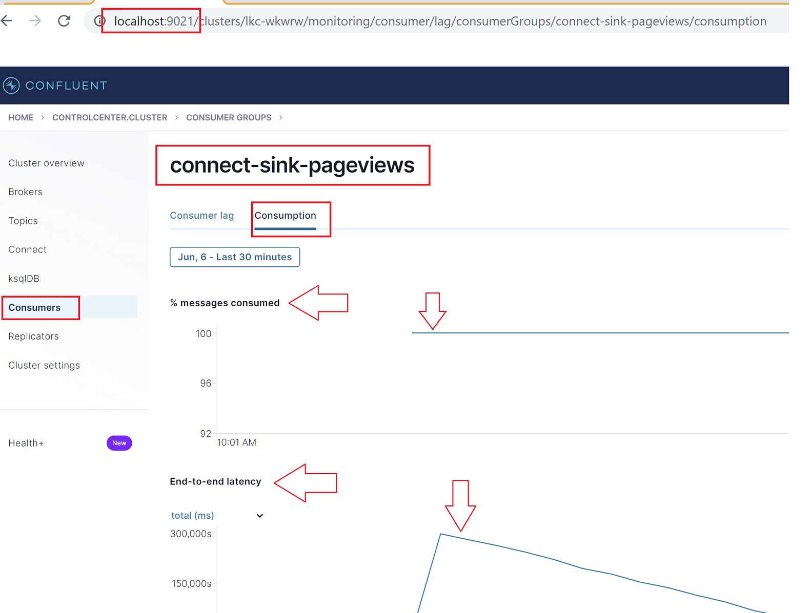

# Shared with connect
## Overview

In this example I configure a Local Confluent Control Center (C3) to with its metrics data on a 
Confluent Cloud (basic) Cluster. I configure a distributed mode Connect cluster to run locally.
Its producer and consumer are pointing at the same Cloud Cluster. And also use the Schema Registry 
associated with the Cluster's environment. 

The producer and consumer on the connect worker are intrumented with Monitoring Interceptors that 
will report to the same Cloud Cluster, so that C3 will be able to display their results

I create a demo by running a datagen Source connector and a postgres sink connector (targeting a 
basic local poostgress instance in docker).

The C3 now displays end-to-end latency for the demonstration data that is based on the Metrics that 
are reported to the Cluster by the Connect-worker's Monitoring Interceptors.


I'm using docs from here: https://docs.confluent.io/cloud/current/cp-component/connect-cloud-config.html

### Start Connect
start the ditributed connect worker (i.e. a cluster of 1 worker), connected to cloud  cluster via
`bootstrap-server`, `value-converter` (avro + schema registry)
ensure the SASL/SSL settings in place for the connect cluster function
and also separately for the producer and consumer functions.

Ensure the settings for both the Producer and Consumer Monitoring Interceptors are in place
These will point to the same cluster (bostraap-server and auth SASL settings).
Your connect cluster must have access to a CLASSPATH containing the interceptor `.jar` file

(Note that if the Connect worker finds valid settings in the `offset.storage.topic`, the 
`config.storage.topic` and the `status.storage.topic`, it may restart pre-existing tasks 
accordingly.


```
$ connect-distributed connect.properties
```

verify successful running of connect worker
NOTE. I'm using `jq` here to apply a friendly format to the `json` responses

```
$ curl -s http://localhost:8083/connectors/ | jq
```

### Start Control Center
ocnfigur C3 to be acked by your CLoud Cluster (bootstrap-server Sasl etc)
Inlcude Schemareguistry settings (`url` and key/secret in basic auth details )

Ensure that you explicitly specify the port number 443 on schema registry endpoint configurations. 
For example, in your control-center.properties file:
```
confluent.controlcenter.schema.registry.url=https://<SCHEMA_REGISTRY_ENDPOINT>:443
```

configure your local connect cluster (from above) into the control center

```
confluent.controlcenter.connect.my-local.cluster=http://localhost:8083
```

Note that the `.my-local.` component is the name with wich this ocnnect cluster will be known to 
C3. It allows you to specify multiple differetn clusters, with different names


### start a data gen source connector

Use the `datagen-pageviews.json.template` to configure a datagen source connector generating 
pageviews data into the `ldg-pageviews-topic`. Supply your schema-registry details.

Verify msges flowing in by going to the `ldg-pageviews-topic` in the confluent cloud console

```
curl -X POST -H "Content-Type: application/json" --data @datagen-pageviews.json localhost:8083/connectors/ | jq
```


### start a sink system (postgres DB)

use the `docker-compose.myl` to start a basic postgres instance running in a local docker .

start `psql` connected to the local postgres instance

```
$ psql -h 127.0.0.1 --username postgres -d demo
```

verify no relations available

```
demo=# \dt
# Did not find any relations.
```


### start a pageview sink connector

Use the `sink-pageviews.json.template` to configure a sink connector  sinking
pageviews data from  the `ldg-pageviews-topic` into the local postgress instance. 
Supply your schema-registry details.

```
 curl -X POST -H "Content-Type: application/json" --data @sink-pageviews.json localhost:8083/connectors/ | jq
```


Verify that messages are flowing using the `psql` client, by checking the table now exists (it was auto-created)
and the record count is increasing. 

```
demo=# \dt
                List of relations
 Schema |        Name         | Type  |  Owner
--------+---------------------+-------+----------
 public | ldg-pageviews-topic | table | postgres
(1 row)

demo=# select count(*) from "ldg-pageviews-topic";
 count
--------
 114936
(1 row)

demo=# select count(*) from "ldg-pageviews-topic";
 count
--------
 115041
(1 row)

```

Verify that the Monitoring interceptors are commuincating data to the Cloud cluster by navigating to 
the *Consumption* tab for the Consumer Group `connect-sink-pageviews` in the C3 section *Consumers*. 




### tidy up


```
curl -X DELETE http://localhost:8083/connectors/datagen-pageviews
curl -X DELETE http://localhost:8083/connectors/sink-pageviews
docker compose down -v
control-center-stop control-center.properties
```

On the terminal tab for your connect cluster, hit ctrl-c. or kill the correct porcess


control center wil have stored an amount of data in the configure `/tmp/` directory. 
If you wiish you can delete this data
```
rm -rf /tmp/control-center/data/1

```

Numerous topics will have been created in your CLoud Cluster. Internal topics for C3 and connect and a demo topic.


remove 
